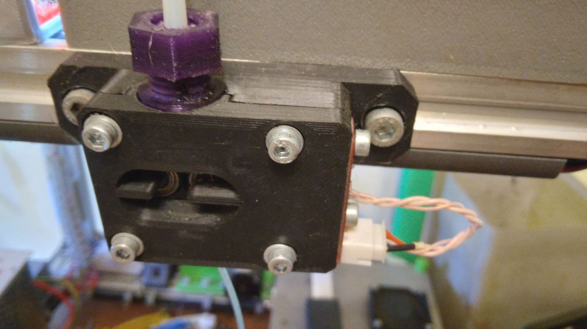

Датчик кінця філаменту на підшипниках та оптичному модулі

BOM:
- оптичний модуль
- 2pcs підшипника mr105zz
- 2pcs пружини від кулькової ручку. Одну ріжемо навпіл: вона буде прудинити оптичний модуль для регулювання діаметру філамента.
- 2pcs DIN912 M5x10, 2pcs M5 t-slot nut, 2pcs M5 washers
- 4pcs DIN912 M3x20,4pcs M3 hex nut,4pcs M3 washers

Прапорець треба зробити непрозорим для оптичного модуля. Або покрасити акриловою краскою (точно знаю що срібляста, бронзова, золота тобто металік), або надрукувати наприклад з чорного АБС.

Бажано ставити префільтр як на другій світлині тому що сміття, вовна від кішки та інший мотлох накопичуються між двома підшипниками - хибні спрацювання.
